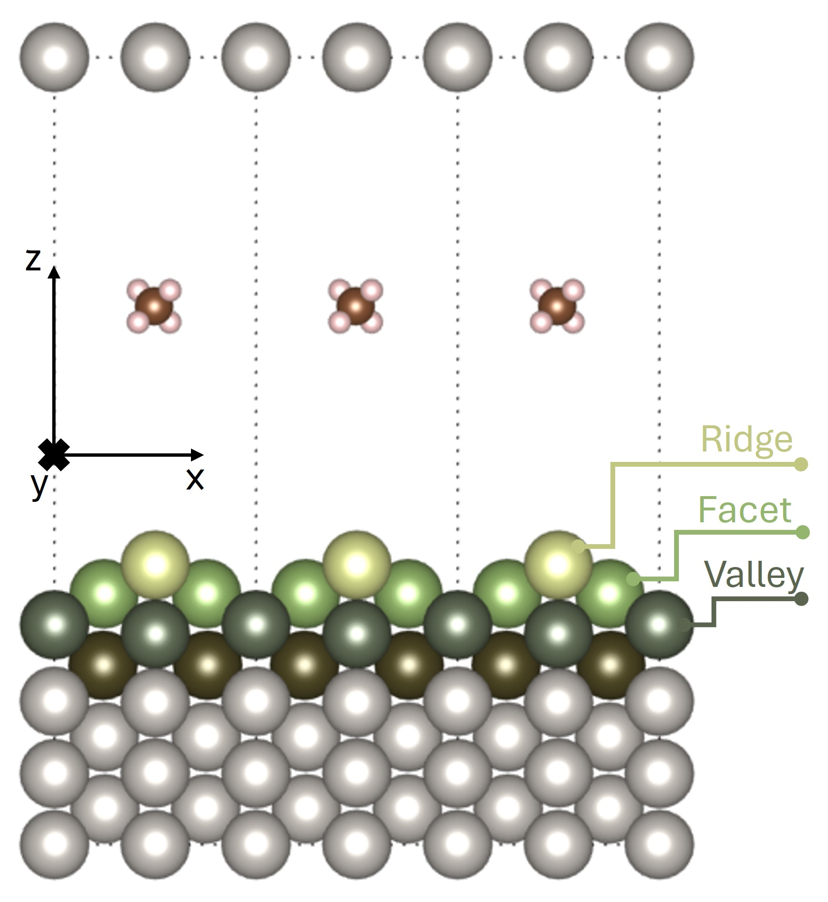

# Computational simulation of the dissociative adsorption of methane molecules on a Platinum(110) surface using automated learning techniques.
This is the repository used to analyse the training of a Neural Network Potential. The training Repository is on the CONICET - Rosario - HPC cluster.
## Repository structure
```
./ |-- DB------|-- Full DB --- *.xsf
   |           |-- DB in batches --- *.xsf
   |           |-- figures
   |           |-- *.ipynb (analysis)
   | 
   |-- GSRD----|-- RS ----------|-- data (Rigid surface calculations)
   |           |                |-- scripts
   |           |                |-- *.ipynb (analysis)
   |           |                |-- figures
   |           |
   |           |-- slabmotion --|-- data (slabmotion calculations)
   |           |                |--*.ipynb (analysis)
   |           |                |-- figures
   |           |                 
   |           |-- MD ----------|-- data (Molecular Dynamics calculations)
   |                            |-- scripts
   |                            |-- *.ipynb (analysis)
   |                            |-- figures
   |-- NNs-----|-- data (Neural Networks)
   |           |-- *.ipynb (analysis)
   |           |-- figures
   |
   |-- VdW-----|-- data (*xsf configurations / Neural Networks)
   |           |-- *.ipynb (analysis)
   |           |-- figures
   |
   |-- Sample_Inputs
   |-- *.ipynb (aditional analysis)
   |-- figures  
```
## System:
This work studies the interaction between a methane molecule and a platinum (110) surface to generate a neural network potential (NNP) capable of reproducing the interaction of the CH4/Pt(110) system.
Dissociation reactions of molecular gases on metallic surfaces represent the rate-limiting step in heterogeneous catalysis processes, such as steam reforming used in the industry to produce molecular hydrogen.

<p align="center">
  
</p>


In a previous work, an iterative method was implemented to expand a database (DB) of atomic configurations calculated using Density Functional Theory (DFT) to train an NNP capable of describing the interaction of the molecule with the surface of the CH4/Pt(110) system, with all surface atoms fixed in their minimum energy position.

Previous works conducted molecular dynamics (MD) to find relevant configurations to incorporate into the DB using potentials like the aforementioned NNP or potentials adjusted with Reactive Force Fields (RFF) for exploration.
For this study, MD simulations were initially conducted to reproduce surface movement, which presented problems and provided a starting point for this work.
These problematic configurations were calculated with DFT and added to the DB to train an NNP using the open-access program ÆNET (Atomistic Energy Network).
This process is iteratively repeated, expanding the DB until obtaining an NNP that provides satisfactory results in describing the system, contrasting with error metrics in predicting the energy associated with each configuration, with experimental data and data from previous works.

## Results
### RMSE: 
<p align="center">
 
</p>

Finally, the obtained final potential was used in MD simulations to evaluate its capabilities.
It satisfactorily described the movement of the atoms on the platinum Pt(110) surface up to a surface temperature (kinetic energy of surface atoms) Ts = 750K, which was the maximum temperature used in training.
The NNP was also evaluated for the CH4/Pt(110) interaction system, considering molecules with incident energies between 0.4eV and 1.4eV, with the surface atoms fixed in their minimum energy position and also allowing them to move from that position considering surface temperatures of 0K, 50K, 300K, and 550K.
The obtained results regarding molecular trajectories, probabilities of molecular and dissociative adsorption, reflection probability, times associated with different events, and molecule-surface distance are within the same orders of magnitude and exhibit similarity with results from other works. 
The validity range of the NNP for the CH4/Pt(110) system could be extended, being able to describe the effect of surface temperature on different observables, concluding that the probability of dissociative adsorption increases with temperature, while the probability of molecular adsorption decreases within the temperature range used.

This work incorporates configurations into the DB to improve the representation of surface movement, thus providing a new tool based on a regressor model capable of describing a dynamic as complex as that of the studied system.

